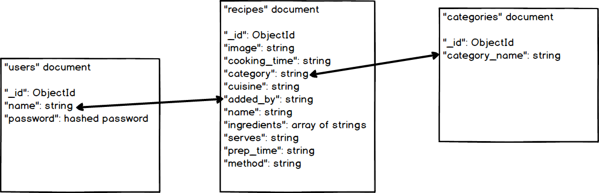

# [Data Centric Development Cookbook Application](https://dcd-cookbook.herokuapp.com/)

I have greated this online cookbook using the Python framework Flask and MongoDB for the Data Centric Development module of the Code Institute Full Stack Web Development diploma. This application allows users to create an account in order to add, edit or delete recipes and to manage the categories associated with them. Users who do not have an account are still able to browse the recipes on the homepage, and filter by category but are restricted to this by basic user authentication.

## UX

From looking at other recipe site ideas on [Dribbble](https://dribbble.com/search?q=cookbook) I knew I wanted to display the recipe information on a 'card', so that it looks like the recipe cards you can pick up from supermarkets. The homepage displays all of the recipes in a browse view, and the user can click the filtering options to narrow this down by category i.e. 'Breakfast' for fast filtering.
I took inspiration for the colour scheme from [Color-Hex](https://www.color-hex.com/color-palette/827)

## User Stories

- A user (with or without an account) wants to view recipes: They can view the recipes on the homepage, and filter by category. The user can click on a card to open up the recipe view.

- A user would like to add a recipe: 
  - The user needs to sign in/create an account to add a recipe. 
  - They should choose to login or sign up from the CTA buttons in the navbar (or side menu if viewing on mobile)
  - On either the login or sign up page, they should enter a username and password, and click the button to sign in or create an account
  - Once logged in, they can choose the 'Add Recipe' option in the navbar
  - The user is navigated to a form in which they can fill in the necessary information about their recipe
  - The form has validation, so all fields must be filled in before the 'Add' button will work.
  - Once they have completed all fields and clicked to 'Add' they will redirected back to their My Recipes page where their recipe will be displayed in the lister view.

- A user wants to edit a recipe:
  - The user must be already logged in, and the user must be the owner of the recipe.
  - If both of the above are satisfied, on the My Recipes page there will be an 'Edit' button inside the card of each recipe.
  - The user clicks the 'Edit' button and is taken to an editing form. The form is pre-filled with the information about the recipe that they inputted.
  - The user can change aspects that they would like to (validation still applies so no fields can be left incomplete)
  - The user can press the button to 'Save changes' or 'Cancel' if they change their mind. Pressing 'Save changes' will post the changes to the database and redirect the user back to the My Recipes page.
  
- A user wants to delete a recipe:
  - The user must be already logged in, and the user must be the owner of the recipe.
  - If both of the above are satisfied, on the My Recipes page a 'Delete' button will appear inside the card.
  - If the user clicks the 'Delete' button, the recipe will be deleted and the user will remain on the My Recipes page.
  
- A user wants to add a category:
  - The user must be already logged in.
  - Once logged in, the user can click the 'Manage Categories' button in the navbar.
  - The user clicks 'Add Category' which will take them to a small form.
  - The user enters the name of the new category and presses 'Add'
  - The user is redirected back to the Categories lister with the new category added - the categories are listed alphabetically.
  
- A user wants to edit a category: 
  - The user must be already logged in.
  - Once logged in, the user can click the 'Manage Categories' button in the navbar.
  - The user clicks 'Edit' next to the category they want to edit, which will take them to a small form.
  - The user enters the new name of the category and presses 'Save Changes'
  - The user is redirected back to the Categories lister with the edited category displayed - the categories are listed alphabetically.
  
- A user wants to delete a category:
  - The user must be already logged in.
  - Once logged in, the user can click the 'Manage Categories' button in the navbar.
  - The user clicks 'Delete' next to the category they want to delete.
  - The user remains on the Categories lister and the category is deleted.
  
- A user wants to view a recipe:
  - On the homepage, or the My Recipes page (when logged in) the user can click on a recipe card to view the recipe information.
  
- A user wants to filter by category:
  - On the homepage, the user can click on the filters in the menu bar (i.e. Breakfast) to filter by meal category.
  - The user is redirected to a filter page displaying only these meals.

- A user wants to log out:
  - Only applicable to logged in users
  - The user can click 'Log Out' in the navbar, they are redirected to the homepage.

## Wireframes created using Balsamiq:

### Homepage

### Add Category

### Add Recipe

### Categories

### Login

### Sign Up

### Recipe View

### Search Results

## Database Schema

## Features
 
### Existing Features
- The site uses basic user authentication to create a user account - the site is then accessible through the login/sign up functionality.
- Users can add a recipe by filling out the fields in the 'Add a Recipe' form. The data from this form is then used to construct the recipe card.
- View recipe card containing image and all information inputted in form including ingredients, method, cooking and preparation time etc.
- There is the ability to Edit/Delete recipes you as a user have added - recipes are protected from deletion by anyone else as delete button only available to owner of recipe.
- A user can Add/Edit/Delete categories

### Features Left to Implement
- Likes on recipes: Users can upvote recipes: I would add an additional field inside each MongoDB document for 'likes' and have this increment by 1 whenever the user clicks on the like button.
- Search bar to filter on keywords: I would add a search bar in the navigation area, which would allow the user to search for keywords featured in the ingredients array.

## Technologies Used

- [Flask](http://flask.pocoo.org/)
    - The project uses **Flask** , a Python micro framework to provide a functional and lightweight core for the application

- [Jinja2](http://jinja.pocoo.org/docs/2.10/)
    - This app uses the **Jinja2** for the front-end templating of the routes outlined in the app.py file. 
    - Modelled on Django's templating style, **Jinja2** is scalable and modular to allow for reusable components

- [HTML5](https://developer.mozilla.org/en-US/docs/Web/Guide/HTML/HTML5)
    - HTML used for the structure of the page templates

- [CSS3](https://developer.mozilla.org/en-US/docs/Web/CSS)
    - Language used to apply styles to each page for styling of the components (e.g. colour schemes, fonts, images)
    
- [Javascript](https://developer.mozilla.org/en-US/docs/Web/JavaScript)
    - I have used Javascript in the add/edit recipe forms to power the logic behind the 'Add Ingredient' and 'Remove Ingredient' buttons. I have also used this to create a validation error for the Materialize select component as there is a known issue with this component showing error messages.
    - JS has also been used to power the sliding side menu action on smaller screen sizes
    
- [Materialize](https://materializecss.com/)
    - I have used Materialize throughout the project to create navbars, side menus, input types in forms and icons
   
- [MongoDB](https://mlab.com/welcome/)
    - I have used MLab to implement a database in this project. This is where all of the user, recipe and category data is stored.

## Testing
I included a piece of custom automated testing in the app to check whether the routing for the site was working correctly, this can be seen here The first test is for the homepage (index.html) - this looks for the response of the page (200, if the page is up for example) and then compares to see if this is equal to the 200 response status needed. If yes, the test passes. This works the same for the other tests, but for the login and signup pages.

## Bugs
TBD

## Deployment

This application is hosted on Heroku at: https://dcd-cookbook.herokuapp.com/ In order to deploy this app to heroku, I added a [Procfile](https://github.com/charlotteskinner90/dcd-milestone-project-recipe-hub/blob/master/Procfile) which tells heroku the language of the app and the name of the file that needs to be run - in this case this was [app.py](https://github.com/charlotteskinner90/dcd-milestone-project-recipe-hub/blob/master/app.py)
I then set up a [requirements.txt](https://github.com/charlotteskinner90/dcd-milestone-project-recipe-hub/blob/master/requirements.txt) file which holds the dependencies that this app requires in order to run. Both the Procfile an requirements.txt file are committed to the repository and pushed to Heroku.
I had to set up some environment variables inside Heroku in order for the app to appear on the live URL. The following are configured under Settings -> Reveal Config Vars
  - IP: 0.0.0.0
  - PORT: 5000

To run this app locally, please use the following steps:
  - Clone this repository and run it in an IDE of your choice.
  - Set your environment variables i.e. IP: 127.0.0.1 and PORT: 5000
  - Install dependencies required for the app to run from the requirements.txt file by running the following command in the terminal **pip install -r requirements.txt**

## Credits

### Content
 
Logic behind making the validation error on the Materialize dropdown came from a solution I found on [Stack Overflow](https://stackoverflow.com/a/36806073)
While researching how to create a button that creates new divs onclick, I came across this [Stack Overflow](https://stackoverflow.com/a/6678088) thread which explained how to use the .append() function to achieve this

### Media

Some example recipes have been obtained from [BBC Good Food](https://www.bbcgoodfood.com/)

### Acknowledgements

I would like to thank my mentor Anthony Ngene for his helpful feedback and support during this project.
