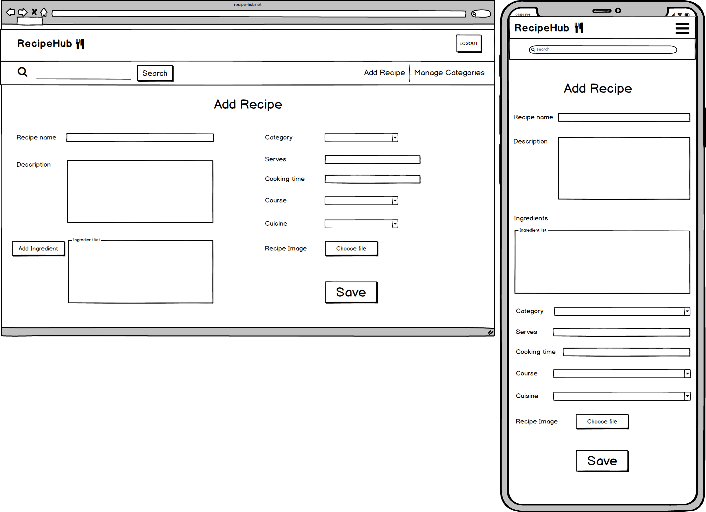

# [Data Centric Development Cookbook Application](https://dcd-cookbook.herokuapp.com/)

I have greated this online cookbook using Python-based frameworks and MongoDB for the Data Centric Development module of the Code Institute Full Stack Web Development diploma.

## UX
TBD

## User Stories
TBD

## Wireframes created using Balsamiq:

### Homepage

### Add Category

### Add Recipe

### Categories

### Login

### Sign Up

### Recipe View

### Search Results

## Database Schema
TBD

## Features
 
### Existing Features
- Login/Sign Up to create an account
- Add a recipe
- Edit/Delete recipes you as a user have added - protected from deletion as delete button only available to owner of recipe
- Edit/Delete categories
- View recipe card containing image and all information inputted in form

### Features Left to Implement
- Likes on recipes
- Search bar to filter on keywords

## Technologies Used

- [Flask](http://flask.pocoo.org/)
    - The project uses **Flask** , a Python micro framework to provide a functional and lightweight core for the application

- [Jinja2](http://jinja.pocoo.org/docs/2.10/)
    - This app uses the **Jinja2** for the front-end templating of the routes outlined in the app.py file. 
    - Modelled on Django's templating style, **Jinja2** is scalable and modular to allow for reusable components

- [HTML5](https://developer.mozilla.org/en-US/docs/Web/Guide/HTML/HTML5)
    - HTML used for the structure of the page templates

- [CSS3](https://developer.mozilla.org/en-US/docs/Web/CSS)
    - Language used to apply styles to each page for styling of the components (e.g. colour schemes, fonts, images)
    
- [Javascript](https://developer.mozilla.org/en-US/docs/Web/JavaScript)
    - I have used Javascript in the add/edit recipe forms to power the logic behind the 'Add Ingredient' and 'Remove Ingredient' buttons. I have also used this to create a validation error for the Materialize select component as there is a known issue with this component showing error messages.
    - JS has also been used to power the sliding side menu action on smaller screen sizes
    
- [Materialize](https://materializecss.com/)
    - I have used Materialize throughout the project to create navbars, side menus, input types in forms and icons

## Testing
TBD

## Bugs
TBD

## Deployment

This application is hosted on Heroku at: https://dcd-cookbook.herokuapp.com/ In order to deploy this app to heroku, I added a [Procfile](https://github.com/charlotteskinner90/dcd-milestone-project-recipe-hub/blob/master/Procfile) which tells heroku the language of the app and the name of the file that needs to be run - in this case this was [app.py](https://github.com/charlotteskinner90/dcd-milestone-project-recipe-hub/blob/master/app.py)
I then set up a [requirements.txt](https://github.com/charlotteskinner90/dcd-milestone-project-recipe-hub/blob/master/requirements.txt) file which holds the dependencies that this app requires in order to run. Both the Procfile an requirements.txt file are committed to the repository and pushed to Heroku.
I had to set up some environment variables inside Heroku in order for the app to appear on the live URL. The following are configured under Settings -> Reveal Config Vars
  - IP: 0.0.0.0
  - PORT: 5000

To run this app locally, please use the following steps:
  - Clone this repository and run it in an IDE of your choice.
  - Set your environment variables i.e. IP: 127.0.0.1 and PORT: 5000
  - Install dependencies required for the app to run from the requirements.txt file by running the following command in the terminal **pip install -r requirements.txt**

## Credits

### Content
 
Logic behind making the validation error on the Materialize dropdown came from a solution I found on [Stack Overflow](https://stackoverflow.com/a/36806073)
While researching how to create a button that creates new divs onclick, I came across this [Stack Overflow](https://stackoverflow.com/a/6678088) thread which explained how to use the .append() function to achieve this

### Media

Some example recipes have been obtained from [BBC Good Food](https://www.bbcgoodfood.com/)

### Acknowledgements

I would like to thank my mentor Anthony Ngene for his helpful feedback and support during this project.
